# IncrementalGenerator

## 成熟的编译器要自己写代码

### DependencyProperty

在自定义控件和用户控件中，如果希望属性支持 XAML 特性，需要对应的 DependencyProperty．

``` C#
public bool IsValid
{
    get => (bool) GetValue(IsValidProperty);
    set => SetValue(IsValidProperty, value);
}

public static readonly bool IsValidProperty = DependencyProperty.Register(
    nameof(IsValid),
    typeof(bool),
    typeof(MyControl),
    new PropertyMetadata(true)
);
```

DependencyProperty 的写法总是遵循指定的模板，手动编写太繁琐，这就需要用到生成器，自动生成这些繁琐的模板代码。

``` C#
访问修饰符 属性类型 属性名称
{
    get => (属性类型) GetValue(属性名称+Property);
    set => SetValue(属性名称+Property, value);
}
                            
访问修饰符 static readonly 属性类型 属性名称+Property = DependencyProperty.Register(
    nameof(属性名称),
    typeof(属性类型),
    typeof(属性所在控件类型),
    new PropertyMetadata(属性默认值)
);
```

### ObservableProperty

在 CommunityToolkit.Mvvm 中有个常见的例子：```ObservableProperty```

添加 [ObservableProperty] 来自动生成属性变化通知的相关代码。

``` C#
[ObservableProperty]
public partial string Username { get; set; }
```

类似地，我们希望，添加 ```[DependencyProperty]``` 来自动生成依赖属性的相关代码。

``` C#
[DependencyProperty]
public partial bool IsValid { get; set; }
```

进一步，还希望可以指定默认值。

``` C#
[DependencyProperty<bool>(DefaultValue = true)]
public partial bool IsValid { get; set; }
```

目前，CommunityToolkit 已经有了 DependencyProperty 生成器。

### 目标

在此案例中，我们将为具有验证输入功能的文本框（AutoValidateBox）的这些属性生成依赖属性：

``` C#
public sealed partial class AutoValidateBox : TextBox
{
    [DependencyProperty<bool>(DefaultValue = true)]
    public partial bool IsValid { get; set; }

    [DependencyProperty]
    public partial Brush InvalidForeground { get; set; }

    [DependencyProperty]
    public partial Brush InvalidBackground { get; set; }

    [DependencyProperty]
    public partial Brush InvalidBorderBrush { get; set; }
}
```

## 旧版源生成器已弃用

SourceGenerator 写法（已弃用）

``` C#
[Generator]
class MyGenerator : ISourceGenerator
{
    public void Initialize(GeneratorInitializationContext context)
    {
    }

    public void Execute(GeneratorExecutionContext context)
    {
    }
}
```

IncrementalGenerator 写法

``` C#
[Generator]
class MyGenerator : IIncrementalGenerator
{
    public void Initialize(IncrementalGeneratorInitializationContext context)
    {

    }
}
```

## 创建生成器项目

为生成器创建一个 .NET Standard 2.0 类库项目

### 在 Visual Studio 中新建解决方案

``` txt
SourceGeneratorExample
├─ CustomControlExample.Controls（自定义控件的类库）
├─ CustomControlExample.Demo（演示自定义控件的程序）
└─ CustomControlExample.SourceGenerators（生成器）
```

#### SourceGeneratorExample


#### CustomControlExample.Controls


项目引用：CustomControlExample.SourceGenerators

csproj 需要更改的设置：

``` xml
<ItemGroup>
    <ProjectReference
    Include="..\CustomControlExample.SourceGenerators\CustomControlExample.SourceGenerators.csproj"
    OutputItemType="Analyzer"
    ReferenceOutputAssembly="false" />
</ItemGroup>
```

#### CustomControlExample.Demo


项目引用：CustomControlExample.Controls

#### CustomControlExample.SourceGenerators


需要额外安装的包：

- Microsoft.CodeAnalysis.Analyzers
- Microsoft.CodeAnalysis.CSharp

csproj 需要更改的设置：

``` xml
<PropertyGroup>
    <TargetFramework>netstandard2.0</TargetFramework>
    <EnforceExtendedAnalyzerRules>true</EnforceExtendedAnalyzerRules>
</PropertyGroup>
```

### 新建生成器

建议把参数重命名为“initContext”，因为稍后还有各种其他“context”．

``` C#
[Generator]
class DependencyPropertyGenerator : IIncrementalGenerator
{
    public void Initialize(IncrementalGeneratorInitializationContext initContext)
    {

    }
}
```

## SyntaxNode 和 ISymbol

SyntaxNode 表示代码结构中的语句或语句块。

ISymbol 表示代码语句或语句块的语义信息。

``` C#
namespace CustomControlExample.Controls;

public sealed partial class AutoValidateBox : TextBox
{
    [DependencyProperty<bool>(DefaultValue = true)]
    public partial bool IsValid { get; set; }
}
```

属性 ```IsValid``` 的 ```ISymbol```，是 ```IPropertySymbol```。

| 属性 | 属性值 |
|------|------|
| DeclaredAccessibility | Accessibility.Public  |
| IsPartialDefinition   | true                  |
| Name                  | "IsValid"             |
| Type                  | bool                  |
| ContainingType        | AutoValidateBox       |
| ContainingNamespace   | CustomControlExample.Controls |

## IncrementalValue(s)Provider

### 管道化操作

对于 IncrementalValue(s)Provider 里的数据，可以连续多次操作和转换。
这部分中，先展示基本操作，然后把它们结合起来。

### 重要 API

```IncrementalValueProvider<T>``` (以下简称 ValueProvider)

```IncrementalValuesProvider<T>``` (以下简称 ValuesProvider)

Value(s)Provider 是封闭的盒子，外界无法直接获取也无法迭代其中的元素。
可以对其进行特定形式的操作，操作的过程中可以获取到和迭代其中元素。
操作得到的仍是这种封闭的盒子。

Provider.jpg)

### 转换

#### 「一对一」

``` txt
Select(TResult transform(TSource source))
```

原参数是 Func<TSource, CancellationToken, TResult> selector，为了便于阅读，写成函数的形式，去掉了 CancellationToken 参数。

##### ValueProvider

``` C#
ValueProvider<TSource> sourceProvider;
ValueProvider<TResult> resultProvider = sourceProvider.Select(source => result);
```

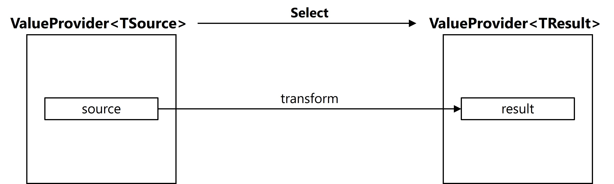

##### ValuesProvider

``` C#
ValuesProvider<TSource> sourcesProvider;
ValuesProvider<TResult> resultsProvider = sourcesProvider.Select(source => result);
```

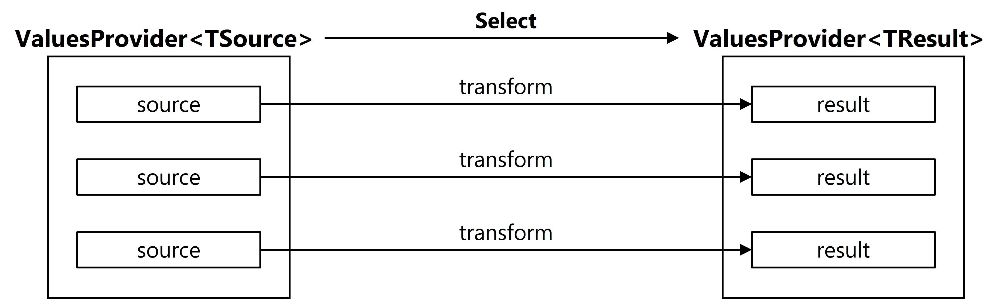

#### 「一对多」

``` txt
SelectMany(IEnumarable<TResult> transform(TSource source))
```

##### ValueProvider

``` C#
ValueProvider<TSource> sourceProvider;
ValuesProvider<TResult> resultsProvider = sourceProvider.SelectMany(source => results);
```

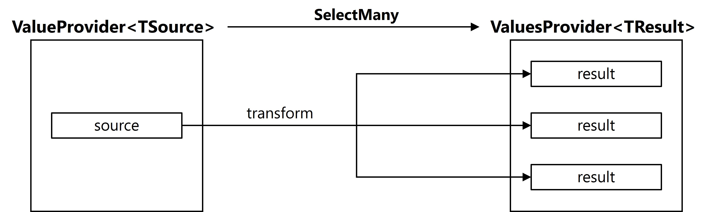

##### ValuesProvider

``` C#
ValuesProvider<TSource> sourcesProvider;
ValuesProvider<TResult> resultsProvider = sourcesProvider.SelectMany(source => results);
```

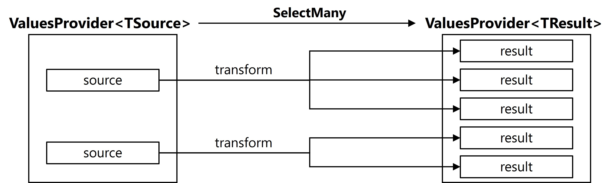

### 筛选

``` txt
Where(bool predicate(T item))
```

``` C#
ValuesProvider<T> sourcesProvider;
ValuesProvider<T> resultsProvider = sourcesProvider.Where(item => 此项是否满足筛选条件);
```

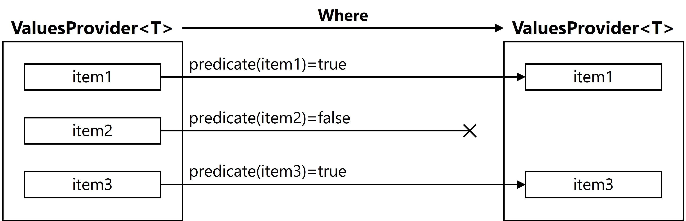

### 从 ValuesProvider 中收集元素到 ValueProvider 中

``` C#
Collect();
```

``` C#
ValuesProvider<T> valuesProvider;
ValueProvider<ImmutableArray<T>> valueProvider = valuesProvider.Collect();
```

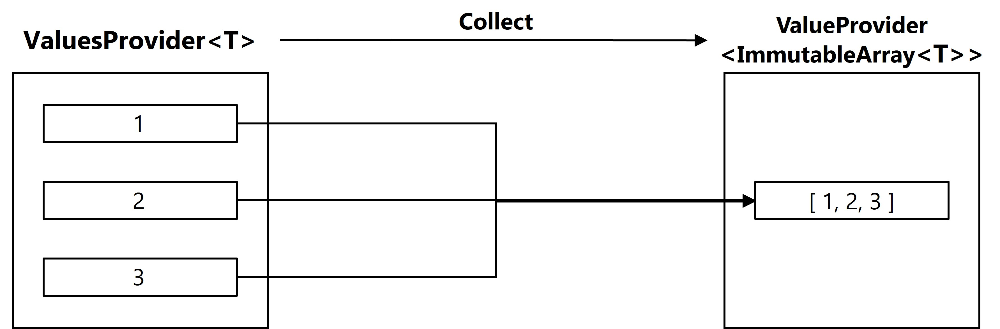

### 组合

``` C#
Combine();
```

#### 「一对一」

``` C#
ValueProvider<T1> provider1;
ValueProvider<T2> provider2;
ValueProvider<(T1,T2)> combined = provider1.Combine(provider2);
```

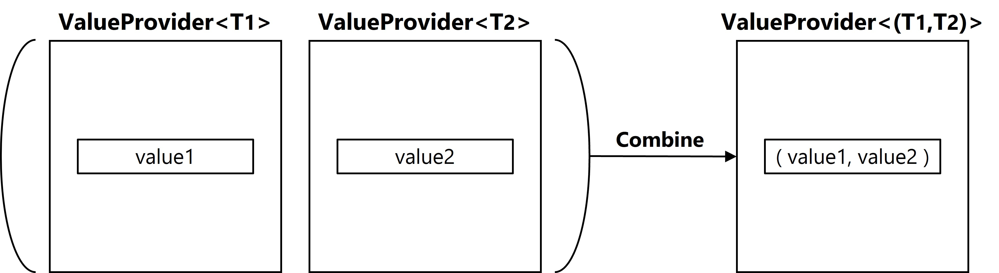

#### 「多对一」

``` C#
ValuesProvider<T1> provider1;
ValueProvider<T2> provider2;
ValuesProvider<(T1,T2)> combined = provider1.Combine(provider2);
```

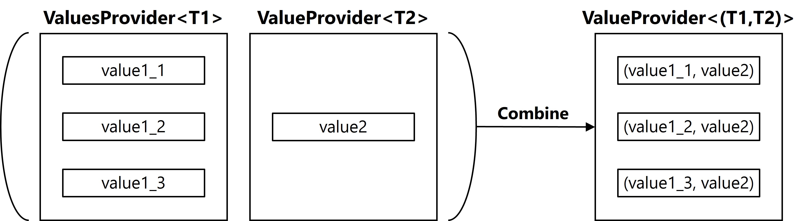

### 融合两个 ValuesProvider

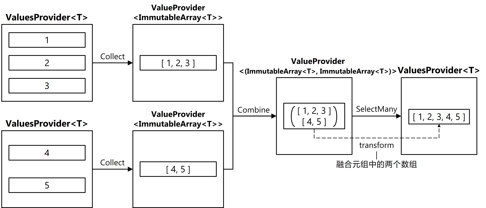

## 编写生成器

### 重要 API

```IncrementalGeneratorInitializationContext```

```ForAttributeWithMetadataName```

```RegisterSourceOutput```

```SourceProductionContext```

```AddSource```

```AttributeData```

#### IncrementalGeneratorInitializationContext

``` C#
[Generator]
class MyGenerator : IIncrementalGenerator
{
    public void Initialize(IncrementalGeneratorInitializationContext context)
    {

    }
}
```

生成器只有 Initialize 这一个方法，IncrementalGeneratorInitializationContext 是一切的切入点。
并不会在 Initialize 中执行生成，而是告诉生成器稍后怎么生成。

#### ForAttributeWithMetadataName

``` C#
IncrementalGeneratorInitializationContext
    .SyntaxProvider
    .ForAttributeWithMetadataName
```

``` C#
public readonly struct SyntaxValueProvider
{
    public IncrementalValuesProvider<T> ForAttributeWithMetadataName<T> (
        string fullyQualifiedMetadataName,
        Func<SyntaxNode, CancellationToken, bool> predicate,
        Func<GeneratorAttributeSyntaxContext, CancellationToken, T> transform
    );
}
```

生成器通常根据 Attribute 寻找目标。
ForAttributeWithMetadataName 会筛选出需要的语法节点，然后对相关信息处理，返回打包的处理结果。

- 按 Attribute 名称（fullyQualifiedMetadataName）筛选 AttributeSyntax 节点

- 按被标记节点筛选 AttributeSyntax 节点

- 对选出的每个 AttributeSyntax 节点相关信息（GeneratorAttributeSyntaxContext）执行 transform

- 返回打包的最终结果

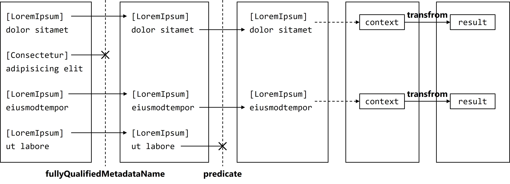

关于 fullyQualifiedMetadataName，是包含完整命名空间信息的元数据名称。

非泛型 ```[DependencyProperty]``` 的 fullyQualifiedMetadataName 像这样：

```C#
Namespace.To.DependencyProperty
```

泛型 ```[DependencyProperty<T>]``` 的 fullyQualifiedMetadataName 像这样：

``` C#
Namespace.To.DependencyProperty`1
```

#### RegisterSourceOutput

``` C#
IncrementalGeneratorInitializationContext
    .RegisterSourceOutput
```

初始化完成后，生成器将执行注册好的生成操作。

``` C#
RegisterSourceOutput(
    IValueProvider<T> 生成时依据的数据，
    Action<SourceProductionContext, T> 依据数据要执行的操作
);
```

``` C#
RegisterSourceOutput(
    IValuesProvider<T> 生成时依据的多个数据，
    Action<SourceProductionContext, T> 依据每个数据要执行的操作
);
```

#### SourceProductionContext

出现在“要执行的操作”中，使用 AddSource 向项目中增加生成的代码。
多次 Add Source 会覆盖掉之前生成的代码文件。

``` C#
RegisterSourceOutput(
    IValueProvider<T> 生成时依据的数据，
    (context, 依据的数据) =>
    {
        做点什么;
        context.AddSource("xxx.g.cs", 代码);
    }
);
```

``` C#
RegisterSourceOutput(
    IValuesProvider<T> 生成时依据的多个数据，
    (context, 依据的每个数据) =>
    {
        做点什么;
        context.AddSource("xxx.g.cs", 代码);
    }
);
```

### DependencyPropertyAttribute

``` C#
[AttributeUsage(
    AttributeTargets.Property,
    AllowMultiple = true,
    Inherited = false)]
public sealed class DependencyPropertyAttribute : Attribute
{
}

[AttributeUsage(
    AttributeTargets.Property,
    AllowMultiple = true,
    Inherited = false)]
public sealed class DependencyPropertyAttribute<T> : Attribute
{
    public T DefaultValue { get; set; }
}
```

### DependencyProperty 生成器

1. 根据非泛型 ```[DependencyProperty]``` 找属性声明

2. 根据泛型 ```[DependencyProperty<T>]``` 找属性声明

3. 把所有属性和是否指定默认值收集起来

4. 按所属类分类（为了按类分文件）

5. 分别对每个类中的属性生成代码，并放在属于这个类的文件里

#### 准备工作 1：要收集的信息

``` C#
struct DependencyPropertyInfo
{
    public IPropertySymbol PropertySymbol { get; set; }
    public bool ManualSetDefaultValue { get; set; }
    public AttributeData AssociatedAttribute { get; set; }
}
```

#### 准备工作 2：合并两个 ValuesProvider

用于合并根据的根据泛型和非泛型收集到的信息。


``` C#
private static IncrementalValuesProvider<T> Merge<T>(
    IncrementalValuesProvider<T> one,
    IncrementalValuesProvider<T> other)
{
    return one.Collect()
        .Combine(other.Collect())
        .SelectMany((tuple, _) =>
        {
            List<T> merged = new List<T>(tuple.Left.Length + tuple.Right.Length);
            merged.AddRange(tuple.Left);
            merged.AddRange(tuple.Right);
            return merged;
        });
}
```

#### 准备工作 3: 获取 Attribute 的属性值

用 AttributeData 找出 ```[DependencyProperty<T>]``` 里的 DefaultValue 属性值。

``` C#
public IncrementalValuesProvider<T> ForAttributeWithMetadataName<T> (
    string fullyQualifiedMetadataName,
    Func<SyntaxNode, CancellationToken, bool> predicate
    Func<GeneratorAttributeSyntaxContext, CancellationToken, T> transform
);
```

在 ```ForAttributeWithMetadataName``` 中，```transfrom``` 的 ```GeneratorAttributeSyntaxContext``` 参数包含一个类型为 ```ImmutableArray<AttributeData>``` 的 ```Attributes``` 属性，即使标注了其他 Attribute，也只包含与 ```fullyQualifiedMetadataName``` 相符的 AttributeData．

``` C#
[LoremIpsum(Dolor = 1)]
[LoremIpsum(Dolor = 2)]
[LoremIpsum(Dolor = 3)]
[SitAmet]
[DependencyProperty]
public partial Brush Background { get; set; }
```

以 "Namespace.To.LoremIpsum" 查找得到的 Attributes 有且仅有

``` C#
[LoremIpsum(Dolor = 1)]
[LoremIpsum(Dolor = 2)]
[LoremIpsum(Dolor = 3)]
```

相关的 ```AttributeData``` .

```AttributeData``` 里包含一个类型为 ```ImmutableArray<KeyValuePair<String,TypedConstant>>``` 的 ```NamedArguments``` 属性，KeyValuePair 的 key 是属性名称，value 是用 ```TypedConstant``` 表示的属性值，通过 ```ToCSharpString()``` 即可得到 C# 中的“字面量”，用在生成的代码中。

``` C#
private static string GetPropertyLiteral(AttributeData attribute, string name)
{
    foreach (KeyValuePair<string, TypedConstant> pair in attribute.NamedArguments)
    {
        if (pair.Key == name)
        {
            return pair.Value.ToCSharpString();
        }
    }
    return null;
}
```

#### 1/5 根据非泛型 ```[DependencyProperty]``` 找属性声明

找到属性声明，并记录

``` C#
struct DependencyPropertyInfo
{
    public IPropertySymbol PropertySymbol { get; set; }
    public bool ManualSetDefaultValue { get; set; }
    public AttributeData AssociatedAttribute { get; set; }
}
```

所需的信息。

``` C#
IncrementalValuesProvider<DependencyPropertyInfo> propertyInfosWithoutDefaultValueProvider = initContext.SyntaxProvider
    .ForAttributeWithMetadataName(
        "CustomControlExample.Controls.Attributes.DependencyPropertyAttribute",
        (syntaxNode, _) => syntaxNode is PropertyDeclarationSyntax,
        (syntaxContext, _) => new DependencyPropertyInfo
        {
            PropertySymbol = (IPropertySymbol) syntaxContext.TargetSymbol,
            ManualSetDefaultValue = false
        }
);
```

#### 2/5 根据泛型 ```[DependencyProperty<T>]``` 找属性声明

``` C#
propertyInfosWithDefaultValueProvider = initContext.SyntaxProvider
    .ForAttributeWithMetadataName(
        "CustomControlExample.Controls.Attributes.DependencyPropertyAttribute`1",
        (syntaxNode, _) => syntaxNode is PropertyDeclarationSyntax,
        (syntaxContext, _) => new DependencyPropertyInfo
        {
            PropertySymbol = (IPropertySymbol) syntaxContext.TargetSymbol,
            ManualSetDefaultValue = true,
            AssociatedAttribute = syntaxContext.Attributes[0]
        }
);
```

#### 3/5 把所有属性和指定默认值的情况收集起来

``` C#
IncrementalValueProvider<ImmutableArray<DependencyPropertyInfo>> allPropertyInfosProvider = Merge(
    propertyInfosWithDefaultValueProvider,
    propertyInfosWithoutDefaultValueProvider
).Collect();
```

这些信息作为生成代码的依据，传给 ```RegisterSourceOutput```:

``` C#
initContext.RegisterSourceOutput(
    allPropertyInfosProvider,
    (sourceProductionContext, propertyInfos) =>
    {

    }
);
```

4/5 按所属类分类

``` C#
initContext.RegisterSourceOutput(
    allPropertyInfosProvider,
    (sourceProductionContext, propertyInfos) =>
    {
        Dictionary<INamedTypeSymbol, List<DependencyPropertyInfo>> propertyInfosOfClass
        = new Dictionary<INamedTypeSymbol, List<DependencyPropertyInfo>>(SymbolEqualityComparer.Default);

        foreach (DependencyPropertyInfo propertyInfo in propertyInfos)
        {
            INamedTypeSymbol ownerClass = propertyInfo.PropertySymbol.ContainingType;
            if (!propertyInfosOfClass.ContainsKey(ownerClass))
            {
                propertyInfosOfClass[ownerClass] = new List<DependencyPropertyInfo>();
            }
            propertyInfosOfClass[ownerClass].Add(propertyInfo);
        }
    }
);
```

5/5 分别对每个类中的属性生成代码，并放在属于这个类的文件里

生成属性的访问器的模板：

``` C#
访问修饰符 partial propertySymbol.Type.Name propertySymbol.Name
{
    get => (propertySymbol.Type.Name) GetValue(propertySymbol.Name+Property);
    set => SetValue(属性名称+Property, value);
}
```

如果不指定默认值：

``` C#
访问修饰符 static readonly DependencyProperty属性名称+Property = DependencyProperty.Register(
    nameof(属性名称),
    typeof(属性类型),
    typeof(所在类名),
    new PropertyMetadata(default(属性类型))
);
```

如果指定默认值：

``` C#
访问修饰符 static readonly DependencyProperty属性名称+Property = DependencyProperty.Register(
    nameof(属性名称),
    typeof(属性类型),
    typeof(所在类名),
    new PropertyMetadata(默认值)
);
```

其中空缺信息都可以获取到：

``` C#
访问修饰符 = GetAccessibilityLiteral(propertyInfo.PropertySymbol.DeclaredAccessibility)

属性类型 = propertyInfo.PropertySymbol.Type.Name

属性名称 = propertyInfo.PropertySymbol.Name

所在类名 = propertyInfo.PropertySymbol.ContainingType.Name

默认值 = GetPropertyLiteral(propertyInfo.AssociatedAttribute, "DefaultValue")
```

这里用到两个自己编写的函数：

``` C#
private static string GetPropertyLiteral(AttributeData attribute, string name)
{
    foreach (KeyValuePair<string, TypedConstant> pair in attribute.NamedArguments)
    {
        if (pair.Key == name)
        {
            return pair.Value.ToCSharpString();
        }
    }
    return null;
}
```

``` C#
private static string GetAccessibilityLiteral(Accessibility accessibility)
{
    switch (accessibility)
    {
        case Accessibility.Private:
            return "private";
        case Accessibility.ProtectedAndInternal:
            return "protected internal";
        case Accessibility.Protected:
            return "protected";
        case Accessibility.Internal:
            return "internal";
        case Accessibility.Public:
            return "public";
        default:
            return string.Empty;
    }
}
```

### 完整的生成器

``` C#
using Microsoft.CodeAnalysis;
using Microsoft.CodeAnalysis.CSharp;
using Microsoft.CodeAnalysis.CSharp.Syntax;

using System.Collections.Generic;
using System.Collections.Immutable;
using System.Text;

namespace CustomControlExample.SourceGenerators
{
    [Generator]
    class DependencyPropertyGenerator : IIncrementalGenerator
    {
        private struct DependencyPropertyInfo
        {
            public IPropertySymbol PropertySymbol { get; set; }
            public bool ManualSetDefaultValue { get; set; }
            public AttributeData AssociatedAttribute { get; set; }
        }

        private static IncrementalValuesProvider<T> Merge<T>(
            IncrementalValuesProvider<T> one,
            IncrementalValuesProvider<T> other)
        {
            return one.Collect()
                .Combine(other.Collect())
                .SelectMany((tuple, _) =>
                {
                    List<T> merged = new List<T>(tuple.Left.Length + tuple.Right.Length);
                    merged.AddRange(tuple.Left);
                    merged.AddRange(tuple.Right);
                    return merged;
                });
        }

        private static string GetPropertyLiteral(AttributeData attribute, string name)
        {
            foreach (KeyValuePair<string, TypedConstant> pair in attribute.NamedArguments)
            {
                if (pair.Key == name)
                {
                    return pair.Value.ToCSharpString();
                }
            }
            return null;
        }

        private static string GetAccessibilityLiteral(Accessibility accessibility)
        {
            switch (accessibility)
            {
                case Accessibility.Private:
                    return "private";
                case Accessibility.ProtectedAndInternal:
                    return "protected internal";
                case Accessibility.Protected:
                    return "protected";
                case Accessibility.Internal:
                    return "internal";
                case Accessibility.Public:
                    return "public";
                default:
                    break;
            }
            return string.Empty;
        }

        public void Initialize(IncrementalGeneratorInitializationContext initContext)
        {
            //Debugger.Launch();
            
            IncrementalValuesProvider<DependencyPropertyInfo> propertyInfosWithoutDefaultValueProvider = initContext.SyntaxProvider
                .ForAttributeWithMetadataName(
                    "CustomControlExample.Controls.Attributes.DependencyPropertyAttribute",
                    (syntaxNode, _) => syntaxNode is PropertyDeclarationSyntax,
                    (syntaxContext, _) => new DependencyPropertyInfo
                    {
                        PropertySymbol = (IPropertySymbol) syntaxContext.TargetSymbol,
                        ManualSetDefaultValue = false
                    });

            IncrementalValuesProvider<DependencyPropertyInfo> propertyInfosWithDefaultValueProvider = initContext.SyntaxProvider
                .ForAttributeWithMetadataName(
                    "CustomControlExample.Controls.Attributes.DependencyPropertyAttribute`1",
                    (syntaxNode, _) => syntaxNode is PropertyDeclarationSyntax,
                    (syntaxContext, _) => new DependencyPropertyInfo
                    {
                        PropertySymbol = (IPropertySymbol) syntaxContext.TargetSymbol,
                        ManualSetDefaultValue = true,
                        AssociatedAttribute = syntaxContext.Attributes[0]
                    });

            IncrementalValueProvider<ImmutableArray<DependencyPropertyInfo>> allPropertyInfosProvider = Merge(
                propertyInfosWithDefaultValueProvider,
                propertyInfosWithoutDefaultValueProvider
            ).Collect();

            initContext.RegisterSourceOutput(
                allPropertyInfosProvider,
                (sourceProductionContext, propertyInfos) =>
                {
                    Dictionary<INamedTypeSymbol, List<DependencyPropertyInfo>> propertyInfosOfClass = new Dictionary<INamedTypeSymbol, List<DependencyPropertyInfo>>(SymbolEqualityComparer.Default);

                    foreach (DependencyPropertyInfo propertyInfo in propertyInfos)
                    {
                        INamedTypeSymbol ownerClass = propertyInfo.PropertySymbol.ContainingType;
                        if (!propertyInfosOfClass.ContainsKey(ownerClass))
                        {
                            propertyInfosOfClass[ownerClass] = new List<DependencyPropertyInfo>();
                        }
                        propertyInfosOfClass[ownerClass].Add(propertyInfo);
                    }

                    foreach (INamedTypeSymbol classSymbol in propertyInfosOfClass.Keys)
                    {
                        StringBuilder stringBuilder = new StringBuilder();
                        stringBuilder.Append(@"
using System;
using Microsoft.UI.Xaml;
using Microsoft.UI.Xaml.Media;
                        ");
                        stringBuilder.Append($@"
namespace {classSymbol.ContainingNamespace}
{{
    {GetAccessibilityLiteral(classSymbol.DeclaredAccessibility)} partial class {classSymbol.Name}
    {{
                        ");

                        foreach (DependencyPropertyInfo propertyInfo in propertyInfosOfClass[classSymbol])
                        {
                            string accessModifier = GetAccessibilityLiteral(propertyInfo.PropertySymbol.DeclaredAccessibility);
                            string propertyTypeName = propertyInfo.PropertySymbol.Type.Name;
                            string propertyName = propertyInfo.PropertySymbol.Name;
                            string ownerClass = propertyInfo.PropertySymbol.ContainingType.Name;

                            stringBuilder.Append($@"
        {accessModifier} partial {propertyTypeName} {propertyName}
        {{
            get => ({propertyTypeName}) GetValue({propertyName}Property);
            set => SetValue({propertyName}Property, value);
        }}
                            ");
                            if (propertyInfo.ManualSetDefaultValue)
                            {
                                stringBuilder.Append($@"
        {accessModifier} static readonly DependencyProperty {propertyName}Property = DependencyProperty.Register(
            nameof({propertyName}),
            typeof({propertyTypeName}),
            typeof({ownerClass}),
            new PropertyMetadata({GetPropertyLiteral(propertyInfo.AssociatedAttribute, "DefaultValue")})
        );
                                ");
                            }
                            else
                            {
                                stringBuilder.Append($@"
        {accessModifier} static readonly DependencyProperty {propertyName}Property = DependencyProperty.Register(
            nameof({propertyName}),
            typeof({propertyTypeName}),
            typeof({ownerClass}),
            new PropertyMetadata(default({propertyTypeName}))
        );
                                ");
                            }
                        }

                        stringBuilder.Append($@"
    }}
}}
                        ");
                        
                        sourceProductionContext.AddSource($"{classSymbol.ContainingNamespace}.{classSymbol.Name}.g.cs", stringBuilder.ToString());
                    }
                }
            );
        }
    }
}

```

## 调试生成器

直接添加断点无法命中，因为生成器在实际运行的程序编译完成前运行。

在要调试的位置添加

``` C#
Debugger.Launch();
```

当生成器在后台运行到此处时，可以使用 Visual Studio 调试。

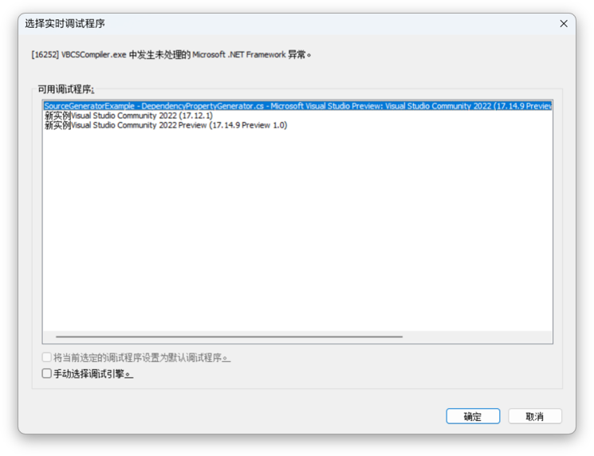
